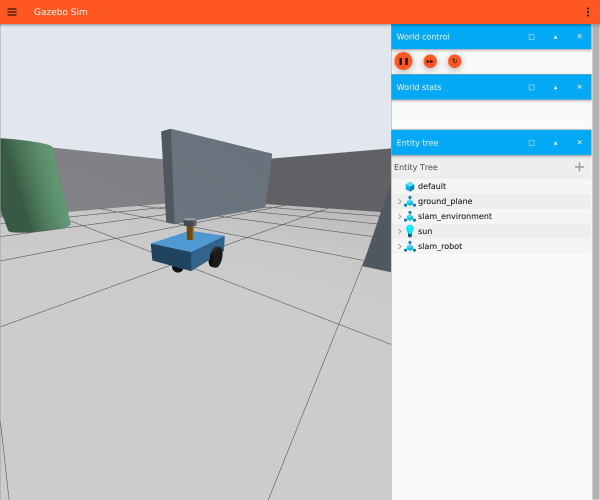
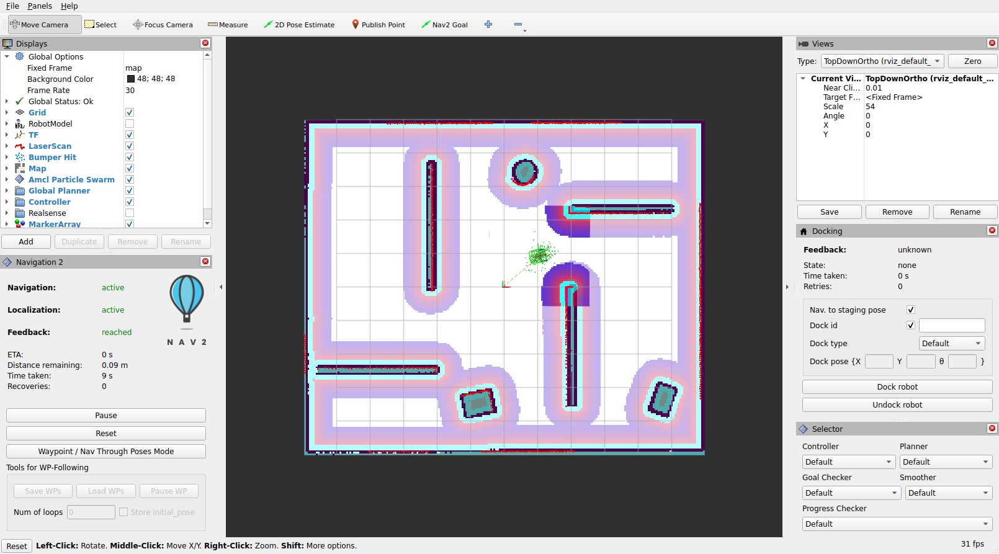

# ROS 2 Multi-Sensor SLAM Simulation

基于 ROS 2 Jazzy 和 Gazebo Sim 的差速轮式机器人多传感器 SLAM 仿真项目。
当前已完成 2D LiDAR 仿真、SLAM Toolbox 建图、地图自动保存、AMCL 定位
和 Nav2 自主导航；自研 C++ 2D SLAM 已具备可运行的前端、位姿图、自动
回环和地图重建链路，并已通过 12.6 m 两圈长闭环、三档快速旋转和
25 m 单向及 50 m 往返退化长走廊回归，并通过双重复房间的假回环保护
测试及 155 m 大场景长时间回归；前端已能识别平行走廊的弱观测方向，
并沿该方向保留轮式里程计预测；155 m 固定 rosbag 的 2× 离线回归也已
通过。3D LiDAR 的互斥机器人变体、点云桥接、TF、RViz 和基础性能验收
也已完成；机器人同时具备 100 Hz IMU，并提供可选的轮速 + IMU 二维
EKF 对照链路。成熟 3D 基线已接入 MOLA 官方 GICP 流水线，并以不伪造
逐点时间的纯激光里程计模式通过首次运动验收。下一步将建立 3D 回环世界
和可重复 rosbag 回归；视觉及其与 3D LiDAR、IMU 的融合随后推进，不计划
融合 2D 与 3D LiDAR。

## 运行效果

### Gazebo 仿真环境



### AMCL 定位与 Nav2 导航



## 当前进度

| 模块 | 状态 | 说明 |
| --- | --- | --- |
| 差速轮式机器人模型 | 已完成 | Xacro、惯性、碰撞体、驱动轮、万向轮和 LiDAR 安装结构 |
| Gazebo Sim 仿真 | 已完成 | 非对称室内场景、差速驱动和 `ros_gz` 消息桥接 |
| 2D LiDAR | 已完成 | 360°、720 个不重复方向、10 Hz、0.12～12 m |
| 2D 激光建图 | 已完成 | SLAM Toolbox `online_async`、回环检测和退出时自动保存 |
| 定位与导航 | 已完成 | Map Server、AMCL、Nav2 官方完整组件和 RViz |
| 导航自动回归 | 已完成 | 多目标导航与动态障碍物重规划 |
| 自研 C++ 2D SLAM | 已完成 2D 基线 | 已完成前后端、场景回归及 155 m 固定 rosbag 的 2× 离线回放 |
| IMU / 二维 EKF | 已完成可选基线 | 100 Hz 原始 IMU；可选轮速平移 + IMU 偏航角速度融合，默认仍使用纯轮速基线 |
| 3D LiDAR | LO 基线已完成 | 16 线点云接入 MOLA GICP，已验证输入契约、TF、轨迹和局部地图 |
| 视觉 / 多传感器融合 | 计划中 | 在 3D 激光链路稳定后逐步接入 |

详细开发路线见 [plan.md](plan.md)，性能和旋转标定结果见
[docs/performance.md](docs/performance.md)，自研 SLAM 工程审查的逐项处理
状态见 [docs/review_remediation.md](docs/review_remediation.md)，固定数据集
指纹与离线复现方式见 [docs/datasets.md](docs/datasets.md)。

2D 阶段现已作为后续开发的回归基线冻结。机器人模型、官方建图、地图
保存、定位导航、自研前后端及自动回归链路均保留；尚未执行的“完全封路
触发 Nav2 恢复行为”属于导航专项补充测试，不阻塞 3D LiDAR 传感器接入。

## 环境与依赖

- Ubuntu 24.04 或对应的 WSL2 环境
- ROS 2 Jazzy
- Gazebo Sim 8（ROS 2 Jazzy 对应的 Gazebo Harmonic）
- `ros_gz`
- SLAM Toolbox
- Navigation2
- `robot_localization`
- MOLA LiDAR odometry、ROS 2 bridge 和 metric maps
- Xacro、`robot_state_publisher` 和 RViz

假设 ROS 2 Jazzy 已正确安装，克隆项目后执行：

```bash
git clone https://github.com/chubbyk-uu/ros2-multisensor-slam-sim.git
cd ros2-multisensor-slam-sim

export SLAM_WS="$PWD"
source /opt/ros/jazzy/setup.bash
rosdep install --from-paths src --ignore-src -r -y
colcon build --symlink-install \
  --cmake-args -DCMAKE_BUILD_TYPE=RelWithDebInfo
source install/setup.bash
```

首次使用模型关节 GUI 时，如系统尚未安装，可执行：

```bash
sudo apt install ros-jazzy-joint-state-publisher-gui
```

运行 3D 激光里程计还需安装 MOLA 的算法及动态加载插件：

```bash
sudo apt install \
  ros-jazzy-mola-lidar-odometry \
  ros-jazzy-mola-bridge-ros2 \
  ros-jazzy-mola-metric-maps
```

后续命令默认在仓库根目录运行。启动文件会以当前目录为基准查找或保存 `maps/`，因此建议每个新终端先执行：

```bash
cd "$SLAM_WS"
source /opt/ros/jazzy/setup.bash
source install/setup.bash
```

## 快速开始

### 1. 查看机器人模型

```bash
ros2 launch slam_robot_description display.launch.py
```

RViz 固定坐标系应为 `base_footprint`，并显示完整机器人和 TF。没有 GUI 关节工具时可用：

```bash
ros2 launch slam_robot_description display.launch.py use_gui:=false
```

模型语法校验：

```bash
xacro src/slam_robot_description/urdf/slam_robot.urdf.xacro \
  -o /tmp/slam_robot.urdf
check_urdf /tmp/slam_robot.urdf
```

### 2. 启动基础仿真

```bash
ros2 launch slam_robot_gazebo simulation.launch.py
```

默认同时打开 Gazebo 和 RViz。无图形界面时：

```bash
ros2 launch slam_robot_gazebo simulation.launch.py \
  gui:=false rviz:=false
```

基础接口：

| 名称 | 用途 |
| --- | --- |
| `/clock` | Gazebo 仿真时间 |
| `/cmd_vel` | 差速底盘速度指令 |
| `/odom` | 默认轮式里程计；可选轮速 + IMU EKF 输出 |
| `/ground_truth/odom` | Gazebo 无噪声真值，仅用于算法评估 |
| `/joint_states` | 轮子关节状态 |
| `/scan` | 2D 激光扫描 |
| `/imu/data_raw` | 100 Hz 原始 IMU |
| `/tf`、`/tf_static` | 动态与静态坐标变换 |

检查 LiDAR 和 TF：

```bash
ros2 topic hz /scan
ros2 topic echo /scan --once
ros2 run tf2_ros tf2_echo base_footprint lidar_link
```

2D 和 3D LiDAR 是同一底盘的两种互斥配置，不会同时生成。默认命令保持
原有 2D 模型；查看 3D 点云使用：

```bash
ros2 launch slam_robot_gazebo lidar_3d_simulation.launch.py
ros2 topic hz /lidar_3d/points
ros2 topic echo /lidar_3d/points --once --field header
ros2 run tf2_ros tf2_echo base_link lidar_3d_link
```

3D 配置不发布 `/scan`，2D 配置不生成 3D 雷达。IMU 在两种配置中都
存在，固定在底盘内部的 `imu_link`；静止时 `linear_acceleration.z`
应约为 `+9.81 m/s²`。

默认 `odometry_mode:=wheel` 保留已有 2D 回归结果。需要比较轮速 + IMU
局部里程计时可使用：

```bash
ros2 launch slam_robot_bringup mapping_simulation.launch.py \
  odometry_mode:=wheel_imu
```

此模式下 Gazebo 发布 `/wheel/odom`，`robot_localization` 只融合轮速的
平面线速度和 IMU 的偏航角速度，再唯一发布 `/odom` 及
`odom -> base_footprint`。IMU 的绝对姿态和线加速度暂不进入二维 EKF。

### 3. 建图

一条命令启动 Gazebo、机器人、SLAM Toolbox 和建图 RViz：

```bash
ros2 launch slam_robot_bringup mapping_simulation.launch.py
```

另开终端遥控：

```bash
cd "$SLAM_WS"
source /opt/ros/jazzy/setup.bash
source install/setup.bash
ros2 run teleop_twist_keyboard teleop_twist_keyboard \
  --ros-args -r cmd_vel:=/cmd_vel
```

建议先直行观察地图对齐，再以较低角速度转弯，最后绕场景形成闭环。建图期间可检查：

```bash
ros2 lifecycle get /slam_toolbox
ros2 topic hz /map
ros2 run tf2_ros tf2_echo map odom
```

同一时间只能运行一个仿真或建图入口。多个 `/clock`、`/odom` 或 TF 发布源会导致时间戳异常和激光错位。

### 4. 保存地图

建图完成后，在运行 launch 的终端按一次 `Ctrl+C`。默认会先保存地图和位姿图，再关闭节点。请等待终端出现：

```text
[auto_save_map] Saving map to: .../maps/slam_map
Map saved with prefix: .../maps/slam_map
[auto_save_map] Save completed; shutting down.
```

默认生成：

- `maps/slam_map.yaml` 和 `maps/slam_map.pgm`：供 Map Server 和 AMCL 使用。
- `maps/slam_map.posegraph` 和 `maps/slam_map.data`：用于恢复 SLAM Toolbox 位姿图。

不要连续按多次 `Ctrl+C`，否则可能在写盘完成前中断进程。自定义保存位置：

```bash
ros2 launch slam_robot_bringup mapping_simulation.launch.py \
  map_output_prefix:="${SLAM_WS}/maps/room_01"
```

运行中也可以手动保存检查点：

```bash
ros2 run slam_robot_slam save_slam_map \
  "${SLAM_WS}/maps/checkpoint"
```

临时关闭自动保存：

```bash
ros2 launch slam_robot_bringup mapping_simulation.launch.py \
  auto_save_map:=false
```

### 5. 定位与导航

确认 `maps/slam_map.yaml` 和 `maps/slam_map.pgm` 存在，然后启动：

```bash
ros2 launch slam_robot_bringup navigation_simulation.launch.py
```

机器人默认从建图原点出生，AMCL 自动使用 `(x, y, yaw) = (0, 0, 0)` 初始化。在 RViz 点击 `Nav2 Goal`，在空闲区域拖出目标朝向即可规划并行驶。

出生点改变时，可使用 RViz 的 `2D Pose Estimate`，或在启动时指定：

```bash
ros2 launch slam_robot_bringup navigation_simulation.launch.py \
  initial_pose_x:=1.0 initial_pose_y:=-0.5 initial_pose_yaw:=1.57
```

无界面运行：

```bash
ros2 launch slam_robot_bringup navigation_simulation.launch.py \
  gui:=false use_rviz:=false
```

导航前请关闭键盘遥控节点，避免多个节点同时向 `/cmd_vel` 发布速度。

### 6. 导航回归测试

完整导航仿真启动后，另开终端执行多目标测试：

```bash
ros2 run slam_robot_navigation navigation_regression.py
```

动态障碍物重规划测试：

```bash
ros2 run slam_robot_navigation navigation_regression.py \
  --scenario dynamic-obstacle
```

测试会检查导航结果、耗时、恢复次数、AMCL 终点误差和代价地图标记；动态场景结束后会自动移除测试箱体。

### 7. 自研 SLAM 开发入口

启动 Gazebo、自研 C++ 2D SLAM（含预处理、前端和后端）及专用 RViz：

```bash
ros2 launch slam_robot_bringup custom_slam_development.launch.py
```

这个入口不会启动 SLAM Toolbox，也不会发布标准 `/map`。它会在
`/custom_slam/map` 发布 `map` 坐标系下的自研占据栅格，并由自研前端
发布 `map -> odom` 校正；RViz 中红色点为原始 `/scan`，绿色点为预处理后的
`/custom_slam/scan_points`，青色点为局部子图匹配后的扫描，黄色线为
自研匹配轨迹。
启动时会先等待 Gazebo 建立仿真时钟和 TF，再依次启动 RViz 与自研节点，
避免点云在 RViz 的 TF 缓存尚未就绪时触发间歇性 `Message Filter` 错误。

检查数据：

```bash
ros2 topic hz /custom_slam/scan_points
ros2 topic hz /custom_slam/laser_odom
ros2 topic echo /custom_slam/scan_points --once --field header
ros2 topic echo /ground_truth/odom --once
```

当前预处理节点会：

- 去除 `NaN`、`Inf` 和量程外数据。
- 按参数执行可选角度降采样。
- 将极坐标 LaserScan 转换为 `lidar_link` 下的二维笛卡尔点集。
- 发布标准 `sensor_msgs/PointCloud2`，供扫描匹配和 RViz 使用。

当前扫描匹配前端参考 slam_toolbox/Karto 与 Cartographer 的成熟结构：

- 使用轮式里程计作为搜索中心，不使用 Gazebo 真值。
- 机器人至少移动 `0.05 m` 或转动 `0.05 rad` 后才建立新关键帧。
- 将当前扫描与最近 20 个关键帧组成的局部相关栅格匹配。
- 先在平移和转角窗口内粗搜索，再做小范围精搜索。
- 根据相关分数和重合点数接受或拒绝匹配，失败时回退到里程计预测。
- 根据最佳匹配附近的响应曲面估计平移可观测秩；平行走廊中只抑制弱
  方向的激光修正，保留横向和航向修正，并发布对应的各向异性协方差。
- 发布 `/custom_slam/laser_odom`、`/custom_slam/laser_path` 和
  `/custom_slam/aligned_scan_points`。
- 只将初始化和匹配成功的关键帧写入 log-odds 占据栅格，并发布
  `/custom_slam/map`。
- 根据匹配位姿与轮式里程计的差值发布 `map -> odom`，使机器人模型和
  原始激光在 `map` 坐标系下得到一致校正。
- 将全部成功关键帧写入 Ceres 二维位姿图，并添加相邻关键帧顺序约束；
  `/custom_slam/pose_graph_path` 显示紫色关键帧路径。
- 周期性排除近期关键帧后按空间距离筛选历史候选，再用候选附近的多帧
  子地图执行独立的高门限相关匹配。
- 在后台线程对关键帧和位姿图快照执行回环匹配与带 Huber 鲁棒核的
  Ceres 全图优化；主线程以事务方式合并优化前缀及期间新增节点，再更新
  紫色关键帧路径和当前 `map -> odom` 校正。
- 回环候选同时满足累计行程、连续历史节点、相关分数、子图支撑占比和
  最大几何修正量约束；原地旋转不再靠关键帧数量误触发回环。

自动执行固定路线并对比真值、轮式里程计和匹配轨迹：

```bash
ros2 run slam_robot_slam scan_matcher_benchmark
```

重复结构假回环保护回归：

```bash
# 终端 1
ros2 launch slam_robot_bringup repeated_structure_slam_regression.launch.py

# 终端 2
ros2 run slam_robot_slam repeated_structure_regression
```

路线先进入第二间相似房间，此阶段不允许接受回环；返回第一间房后，工具
按关键帧时间戳对齐 Gazebo 真值，逐条确认已接受回环两端确实位于同一
物理位置。真值只用于测试控制和判定，不进入 SLAM 节点。

大场景长时间回归：

```bash
# 终端 1
ros2 launch slam_robot_bringup large_scale_slam_regression.launch.py

# 终端 2
ros2 run slam_robot_slam large_scale_regression
```

默认在 `26 × 20 m` 仓储世界中行驶两圈并返回起点，路线约 `155 m`。
工具自动检查连续误差、多次回环、地图重建追赶、Path 数量上限和关键
日志，并从 Linux `/proc` 采集自研 SLAM 进程的 CPU 与 RSS；Gazebo 真值
只用于测试驾驶和结果判定。

固定大场景数据集的录制约束、SHA-256 和 2× 离线回归命令见
[docs/datasets.md](docs/datasets.md)。专用数据集不会录制 `/custom_slam/*`
或动态 `/tf`，回放时所有 SLAM 输出都由当前代码重新计算。

点到线 ICP 作为独立的算法对照和单元测试保留，不是默认运行前端。
自动回环检测和位姿图优化已经接入。每个关键帧会同时保存降采样后的
射线终点和命中状态；回环优化后在独立地图实例中分批重放全部射线，
追上期间新增的关键帧后再原子替换 `/custom_slam/map`。重建过程中出现
新回环时会保留当前进度，并只排队最新优化快照，不会把已完成进度清零。
这样黑白栅格、
紫色位姿图路径和当前 `map -> odom` 都使用优化后的结果，同时不会用
一次长回调阻塞 10 Hz 激光前端。回环候选匹配和 Ceres 优化均在后台
处理，激光回调只创建只读快照并合并已完成的结果。

激光轨迹按 3 cm / 0.03 rad 的移动阈值记录，并与位姿图路径统一以
2 Hz 发布；两条 Path 都有位姿数量上限，避免长时间运行时产生多 MB
消息和逐帧全量拷贝。

相关匹配分数只对落入局部子图有效范围的点求均值，同时把有效点占整帧
的比例作为独立门限。进入新区域时，新观测不会机械拉低已有重叠区域的
相关分数；极少量偶然重叠仍会因支撑占比不足被拒绝。

录制可重复使用的 SLAM 数据集：

```bash
ros2 launch slam_robot_slam record_slam_data.launch.py
```

默认以 MCAP 格式保存到当前仓库的 `bags/slam_data_YYYYMMDD_HHMMSS/`，包括 `/clock`、`/scan`、`/odom`、`/ground_truth/odom`、`/tf`、`/tf_static` 和 `/robot_description`。录制结束时按一次 `Ctrl+C`，然后可用以下命令查看：

```bash
ros2 bag info bags/slam_data_YYYYMMDD_HHMMSS
```

指定输出目录：

```bash
ros2 launch slam_robot_slam record_slam_data.launch.py \
  output:="${SLAM_WS}/bags/first_run"
```

`/ground_truth/odom` 只能用于离线评估，禁止作为自研 SLAM 的输入，否则得到的轨迹误差没有意义。数据集默认被 Git 忽略。

不启动 Gazebo，直接回放数据并运行预处理节点：

```bash
ros2 launch slam_robot_slam play_slam_data.launch.py \
  bag:="${SLAM_WS}/bags/first_run"
```

回放入口默认打开专用 RViz，并在发布数据前等待 2 秒，让节点和订阅关系完成初始化。可通过 `rate:=0.5` 慢速播放，或通过 `loop:=true` 循环播放。

### 8. 运行 3D 激光里程计基线

一条命令启动 3D 机器人、点云输入检查、MOLA GICP 和官方 RViz：

```bash
ros2 launch slam_robot_slam_3d mola_lo_simulation.launch.py
```

当前 Gazebo 点云没有真实雷达常见的逐点时间字段，因此启动器明确关闭
deskew，按纯 LiDAR odometry 运行；不会生成假时间字段，也不会把
`/ground_truth/odom`、轮式里程计或 IMU 偷喂给算法。默认
`use_imu_gravity:=false`；可选的 `use_imu_gravity:=true` 仅提供重力方向
先验，不等于完整 LIO。详细接口和 TF 职责见
[3D SLAM 包说明](src/slam_robot_slam_3d/README.md)。

## 系统结构

数据流：

```text
teleop / Nav2 -> /cmd_vel -> Gazebo diff drive
  -> wheel mode: /odom + odom -> base_footprint
  -> wheel_imu mode: /wheel/odom + /imu/data_raw -> EKF
     -> /odom + odom -> base_footprint
Gazebo 2D LiDAR -> /scan
Gazebo 3D LiDAR variant -> /lidar_3d/points -> MOLA GICP LO
  -> /lidar_odometry/pose + /lidar_odometry/localmap_points
  -> map -> odom
Gazebo world pose -> /ground_truth/odom（仅评估）
robot_state_publisher -> /tf、/tf_static
/scan + TF + /odom -> SLAM Toolbox -> /map、map -> odom
/scan -> custom C++ preprocessing -> /custom_slam/scan_points
/scan + /odom + TF -> local correlative matcher
  -> /custom_slam/laser_odom、/custom_slam/laser_path
  -> map -> odom
  -> keyframes + sequential constraints
  -> background loop closure + Ceres pose graph
  -> optimized ray replay -> /custom_slam/map（map frame）
saved map + /scan + TF -> AMCL / Nav2
```

TF 树：

```text
map
└── odom
    └── base_footprint
        └── base_link
            ├── left_wheel_link
            ├── right_wheel_link
            ├── caster_link
            ├── imu_link
            └── LiDAR 二选一
                ├── lidar_mount_link -> lidar_link（2D）
                └── lidar_3d_mount_link -> lidar_3d_link（3D）
```

`base_footprint` 位于驱动轮轴线中点的地面投影，是差速运动学旋转中心。几何轮距为 `0.34 m`；Gazebo 中按原地旋转标定的有效运动学轮距为 `0.306 m`，仅用于驱动和里程计参数。

传感器路线有意保持清晰：2D 与 3D LiDAR 用于两条独立 SLAM 基线；IMU
可服务于二维局部里程计和后续 LIO。最终多传感器阶段优先研究
3D LiDAR + 相机 + IMU，不把 2D/3D 两套雷达机械叠加在同一模型上。

## 包结构

- `slam_robot_description`：Xacro、模型资源和模型显示。
- `slam_robot_gazebo`：Gazebo 世界、系统插件和 ROS-Gazebo 桥接。
- `slam_robot_bringup`：建图、导航、自研 SLAM 和各类仿真回归的统一启动入口。
- `slam_robot_slam`：SLAM Toolbox、自研 C++ SLAM、数据录制和算法测试。
- `slam_robot_slam_3d`：3D 点云输入契约、MOLA GICP 适配和后续 3D SLAM 回归。
- `slam_robot_navigation`：Map Server、AMCL、Nav2 配置和自动回归工具。

## WSL2 与已知现象

- 在 WSL2 中，launch 默认使用 Mesa D3D12，并选择名称包含 `NVIDIA` 的适配器。AMD 或 Intel 显卡可传入 `wsl_gpu_adapter:=AMD` 或对应名称；非 WSL 环境默认不启用该设置。
- `Anti-aliasing level ... is not supported` 是 Ogre2 将不支持的 FSAA 级别回退到可用值的警告，不影响仿真、传感器或 SLAM。
- 10 Hz LiDAR 在机器人转弯时可能出现几厘米的短暂点云偏移；停稳后能够重新对齐且地图没有持续重影，通常属于扫描周期和 0.05 m 地图分辨率的正常表现。
- Nav2 和 Gazebo 的组合进程在 `Ctrl+C` 退出时可能打印生命周期或强制终止日志；如果运行过程正常且地图保存已完成，不代表导航失败。

## License

本项目采用 [Apache License 2.0](LICENSE)。
